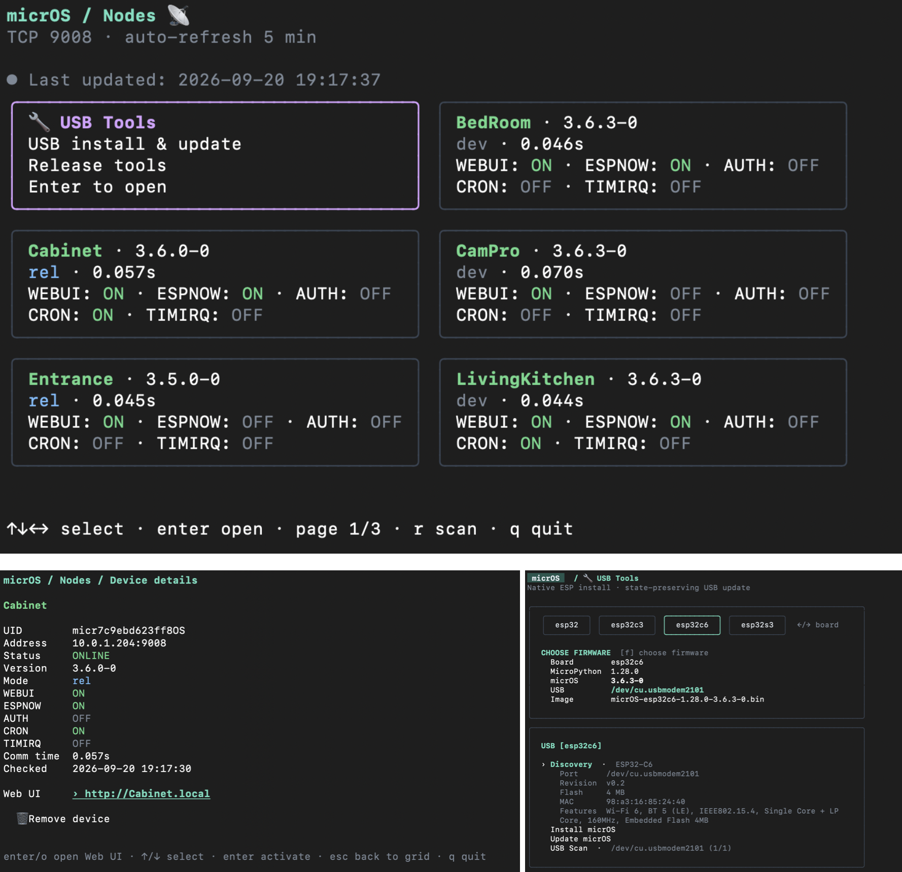

# microsctl

> Current custom micropython binaries don't have binary OTA update support -- comming-soon


A terminal app for discovering micrOS nodes and installing or updating ESP boards over USB. Native Go, with firmware and resources bundled into one executable;



## Install and run

Run in the directory where you want the executable:

```sh
curl -fsSL https://raw.githubusercontent.com/BxNxM/micrOSrelease/main/dist/install.sh | sh

./microsctl
```

Prebuilt binaries support macOS ARM64, Linux x64, Linux ARM64 (including Raspberry
Pi running 64-bit Raspberry Pi OS), and Windows x64. The installer automatically
selects the matching binary. Raspberry Pi requires a 64-bit OS; 32-bit ARM is not
supported. On Windows, run the installer in Git Bash, MSYS2, or Cygwin, then use
`./microsctl.exe`.

### Advanced

To build from a checkout, use Go 1.25 or newer:

```sh
go build -o microsctl .
./microsctl
```

Optional settings (shell examples):

```sh
./microsctl --cidr 10.0.1.0/24  # Explicit IPv4 scan range: /24 or smaller
./microsctl --data-dir ./data   # Portable cache and backups
MICROS_PASSWORD='your-password' ./microsctl  # Password-protected nodes
./microsctl --list-assets      # List bundled firmware and resources, then exit
```

## Find and use nodes

**Nodes** is the home screen. Use arrows to select a card and **Enter** for
details. Cards show identity, address, availability, version, mode, latency,
and WEBUI/ESPNOW/CRON/TIMIRQ flags; unknown values appear as `n/a`.
In details, open **Web UI** (or press **o**) when enabled, or remove a node
from the local cache. A later scan can rediscover it.

Saved nodes appear immediately, marked **saved**, while a background scan checks
TCP port 9008. Scans repeat every five minutes; **r** refreshes manually.
Automatic discovery checks active private IPv4 networks, capped to /24 per
interface. Protected nodes need `MICROS_PASSWORD` to be identified.

**localhost** (`127.0.0.1:9008`) and **AP mode** (`192.168.4.1:9008`) are also
checked on every scan, regardless of the LAN range. Both use blue cards and appear
only when reachable. The same node at multiple addresses appears once. Web UI uses
`http://<node-name>.local` for LAN nodes and the local/AP address for special cards.

## Install or update over USB

1. Connect the board and open **USB Tools** from the Nodes screen.
2. Run **Discovery** to identify connected boards and select the latest matching
   bundled firmware. This resets boards. **USB Scan** only lists ports.
3. Check the selected USB device, board, and firmware. Use **[ / ]** to switch
   devices, **← / →** to switch boards, and **f** to choose firmware.
4. Choose **Install micrOS** or **Update micrOS**, then confirm with **y** or
   **Enter**; **n** or **Esc** cancels the confirmation.

Discovery shows flash capacity in MB (or KB); unavailable capacity appears as **Unknown**.
Firmware cards list newer micrOS versions first and highlight the version in the
theme's mint accent color. Matching micrOS versions show newer MicroPython first.

Some native-USB boards need **BOOT held while connecting USB** to expose their
programming port. Use that port for Install. After flashing, release BOOT and
reconnect/reboot normally when the app reaches **Reconnect to MicroPython REPL**;
it then copies the bundled files. Boards with automatic reset follow the same flow.

**Install micrOS erases the selected device** and copies the bundled resources.
**Update micrOS** preserves configuration and user files, while replacing files
at bundled resource destinations. Before replacing firmware, it saves a verified
filesystem ZIP to the host. Backup failures or limits (1 MiB per file, 64 MiB
total) stop the update before erase. When chip and both micrOS/MicroPython
versions already match, update refreshes resources without reflashing.
Update must start with MicroPython running normally so it can back up your files.
If the required bootloader transition fails, it stops before erase and reports
the backup path; it never falls back to a clean install. Boards that require
manual mode changes may not support Update yet.
During bundled file uploads, one updating line shows the current file and its
position in the upload list, for example `Uploading 3/42 · /modules/LM_system.mpy`.
The firmware stage also shows its current step: bootloader connection, erase,
write/verification with transfer percentage, and reset.
Failures remain in the **Install** or **Update** panel with the failed stage and
full error, including the affected file or backup path when available. If you leave
a running operation, a failure reopens its panel so you can review those details.
If only the final reset fails after all files are verified, reboot normally without
holding BOOT; another install is not required.

During **Reconnect to MicroPython REPL**, you may unplug/reconnect USB and leave
the operation open; it resumes without flashing again. On macOS, keep the cable
on the same physical USB socket: reconnect follows it even if firmware changes
both the serial identity and port name. On other hosts, a stable USB serial
identity allows a different port; without one, the original port is required.
The reconnect detail shows the new port when it appears. This stage waits
indefinitely by default; **Ctrl+C** cancels and exits.
Keep USB connected during flashing and file transfers.

Use **↑ / ↓** to choose an action or firmware, **Enter** to select, **Esc** to
go back, and **q** to quit when idle.
Returning to Nodes after Install or Update automatically refreshes network
discovery, just like **r**. If USB work is still running, it refreshes when that
operation finishes.

## Data and backups

Data lives in the platform user configuration directory under `microsctl`
(macOS: `~/Library/Application Support/microsctl`), or in `--data-dir`:

- `devices.json`: last-known node observations.
- `backups/`: timestamped configuration snapshots and pre-flash filesystem ZIPs.
- `firmware/`: reserved; firmware download/import is not implemented.

Backups can contain node credentials and are created with private permissions.
Keep them until you have verified the updated device. To change bundled firmware
or resources, rebuild the app; see [Architecture](ARCHITECTURE.md) for asset
refresh, implementation, and development checks. [AGENTS.md](AGENTS.md) records
the repository's coding and structure rules.
